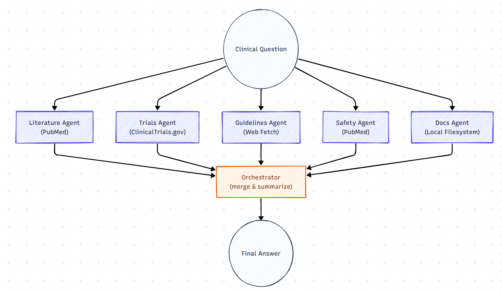

# Clinical Research Agents (Azure AI Foundry + MCP)

**Goal:** Run a local, multi‑agent healthcare demo that calls the **Azure AI Foundry** new Agentic  and uses **published MCP servers** to gather evidence from PubMed, ClinicalTrials.gov, the web (guidelines), and a local policy folder.


## Quick Start (Windows cmd.exe style)

```bat
pip install -r requirements.txt
```

```bat
npm i -g @cyanheads/pubmed-mcp-server clinicaltrialsgov-mcp-server @sylphlab/tools-fetch-mcp @modelcontextprotocol/server-filesystem
```

**Set env:**
```bat
set AZURE_AI_PROJECT_ENDPOINT=https://<service>.services.ai.azure.com/api/projects/<project>
set AZURE_AI_MODEL_DEPLOYMENT_NAME=<deployment>
set KNOWLEDGE_DIR=knowledge

set DEBUG_DOCS=1
set ALLOW_FS_FALLBACK=1
set MCP_FS_CMD="C:\Program Files\nodejs\npx.cmd"
set MCP_PUBMED_CMD="C:\Program Files\nodejs\npx.cmd"
set MCP_CT_CMD="C:\Program Files\nodejs\npx.cmd"
set MCP_FETCH_CMD="C:\Program Files\nodejs\npx.cmd"

```
**Run:**
```bat
python main.py "what is the discharge hospital policy"
```

## Structure

```
clinical-evidence-simple/
├─ prompts/              # prompt library (plain .txt)
│  ├─ literature.txt
│  ├─ trials.txt
│  ├─ guidelines.txt
│  ├─ safety.txt
│  ├─ docs.txt
│  └─ orchestrator.txt
├─ knowledge/            # Local MCP sandbox root
│  ├─ hospital_policy.txt
│  ├─ obesity_clinic_policy.txt
│  ├─ glp1_local_protocol.txt
│  └─ telehealth_policy.txt
├─ main.py               # single entrypoint (loads prompts/*.txt)
├─ smoke_test_local_mcp.py   # test local mcp - can have issues with setting up a server locally
├─ requirements.txt
└─ README.md
```

## Flow

```
Orchestrator
  ↳ (parallel) Literature | Trials | Guidelines | Safety | Docs
  ↳ Compose → Final answer with Sources

```


**Notes**
- Filesystem MCP is sandboxed to `knowledge/`; the code only uses relative paths to avoid “outside allowed directories” errors
- Edit prompts in `prompts/*.txt` without touching code.
- If PowerShell script policy blocks `npx`, use `cmd.exe` or set the `MCP_*_CMD` env vars to `npx.cmd` as above.
